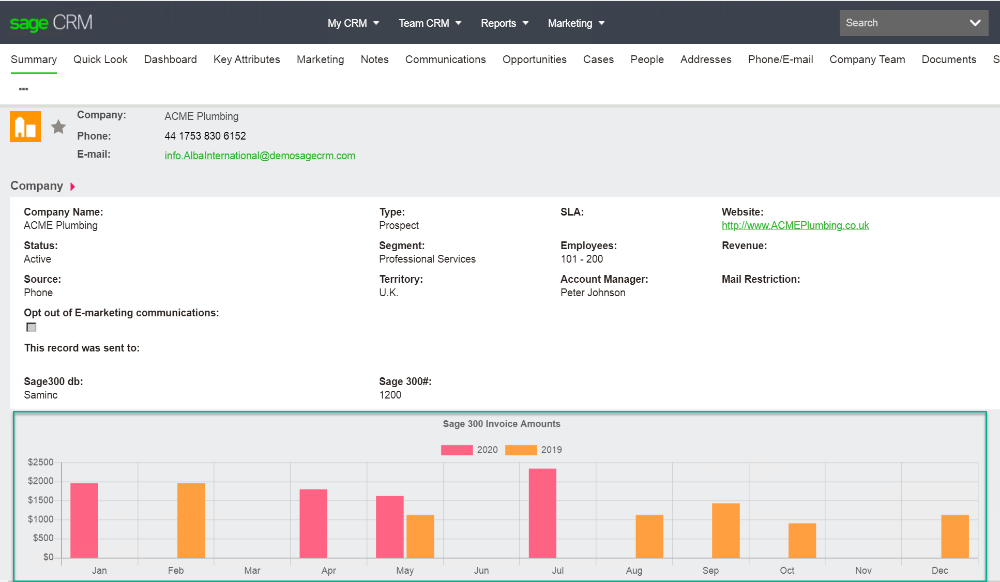

# sage300-charts-in-crm
14 May 2020 - Changed how the chart is inserted to use a custom field in CRM as the table index seems to keep changing. 
So you would create a field in "company" 
We created a field called "comp_graphfield" (integer) and add this to the screen "companyboxlong". 
You should probably keep the field on its own line in the screen and also set the field to be readonly.

===============

Example code showing how you can create a Chart from Sage 300 data in a Sage CRM Company summary screen.

Video run through available on our vimeo channel https://vimeo.com/402992173

Provide a better user experience (and demo) within Sage CRM by displaying a graph showing Sage 300 data.

This example code shows you a bar chart displaying the previous 2 years invoices per month 

Assumptions:
Two fields on company
1. comp_database
2. comp_custid

comp_database holds the name of the company database. Using the example Sage 300 database we set this to SAMINC.
comp_custid holds a Sage 300 customer ID.

To install this you must clone or download the files

Copy the file
	sage300crmgraph\js\ctsage300.js
	
This is the javascript that requests the graph and places it into the screen	

The copy the folder
	sage300crmgraph\CustomPages\company
to your CRM installs CustomPages folder.

Reload the Sage CRM App pool in IIS OR restart IIS. 

Path of the CRM Together Open Source Initiative

https://crmtogether.com/products/open-source/

